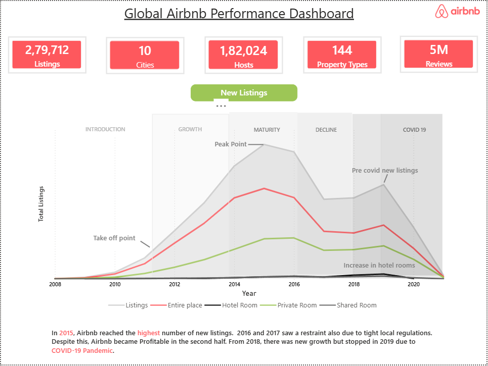

# Global Airbnb Performance Dashboard

A Power BI dashboard exploring Airbnb listing trends, pricing, and guest ratings across 10 cities worldwide.

---

## Page 1 — Overview

Covers the full listing lifecycle from 2008 to 2021, broken down by room type — Entire Place, Hotel Room, Private Room, and Shared Room. The timeline captures every major phase Airbnb went through, from early traction to the COVID-19 impact.

A few things that stand out:
- 2015 was the peak year for new listings globally
- 2016–2017 saw a slowdown driven by tighter local regulations
- Growth picked back up in 2018 before COVID cut it short in 2019

---

## Page 2 — Ratings & Market Share

Breaks down performance by city — who dominates listings, how prices compare by room type, and how guests actually rated their stays.

- Paris, NYC, and Sydney make up nearly half of all listings and 59% of reviews
- Hotel rooms average $800/night vs $462 for a private room on Airbnb
- Mexico City and Rio de Janeiro are the highest rated cities overall
- Hong Kong and Istanbul sit at the bottom of the ratings

---

## Dataset

| Metric         | Value     |
|----------------|-----------|
| Total Listings | 2,79,712  |
| Cities         | 10        |
| Hosts          | 1,82,024  |
| Property Types | 144       |
| Reviews        | 5 Million |

---

Built with Power BI Desktop · DAX · Power Query
